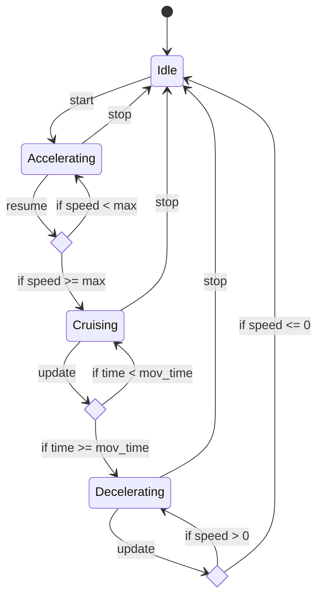

# Hextronics Firmware Framework - HexFF

## Driver - DC/BLDC Motors

---

### DCMotor

```mermaid
stateDiagram-v2
%%    direction LR
    [*] --> Idle
%%

    Idle --> Accelerating: start
%%    Idle --> Idle: resume
%%

    state ResumeAccelerating <<choice>>
    Accelerating --> ResumeAccelerating: resume
    ResumeAccelerating --> Accelerating: if speed < max
    ResumeAccelerating --> Cruising: if speed >= max
    Accelerating --> Idle: stop
%%

    state ResumeCruising <<choice>>
    Cruising --> ResumeCruising: update
    ResumeCruising --> Cruising: if time < mov_time
    ResumeCruising --> Decelerating: if time >= mov_time
    Cruising --> Idle: stop
%%

    state ResumeDecelerating <<choice>>
    Decelerating --> ResumeDecelerating: update
    ResumeDecelerating --> Decelerating: if speed > 0
    ResumeDecelerating --> Idle: if speed <= 0
    Decelerating --> Idle: stop
%%
```